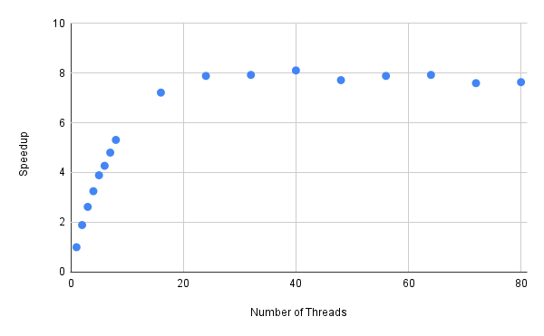

| Thread Count | Wall Clock Time | User Time | System Time | Speedup |
| :-------------: | -----------------: | --------: | ----------: | :-----: |
|        1        |              14.34 |     13.82 |        0.41 |  1.00   |
|        2        |               7.57 |     14.12 |        0.52 |  1.89   |
|        3        |               5.48 |     14.73 |        0.69 |  2.62   |
|        4        |               4.41 |     15.25 |        0.82 |  3.25   |
|        5        |               3.69 |     15.72 |        0.81 |  3.89   |
|        6        |               3.36 |     16.41 |        0.99 |  4.27   |
|        7        |               2.99 |     16.64 |        1.04 |  4.80   |
|        8        |               2.70 |     16.77 |        1.14 |  5.31   |
|       16        |               1.99 |     18.63 |        2.93 |  7.21   |
|       24        |               1.82 |     19.22 |        6.73 |  7.88   |
|       32        |               1.81 |     18.62 |       17.15 |  7.92   |
|       40        |               1.77 |     18.23 |       28.18 |  8.10   |
|       48        |               1.86 |     17.75 |       35.62 |  7.71   |
|       56        |               1.82 |     17.47 |       33.20 |  7.88   |
|       64        |               1.81 |     17.28 |       38.84 |  7.92   |
|       72        |               1.89 |     17.29 |       47.51 |  7.59   |
|       80        |               1.88 |     17.56 |       41.98 |  7.63   |

It's clear that more threads aren't necessarily better. There seems to be a limit (around 16 threads) where additional threads don't make the program any faster.

"Perfect" scaling doesn't seem possible since there must be some cost to synchronizing threads.

Using Ahmdahl's law the expected speed-up for 16 threads should be:

$$ speedup = \frac{1}{1 - p + \frac{p}{n}} = 15.01$$
(Where $p = 0.9956$ and $n = 16$).

The slope of the speed-up at the roughly linear section of at the beginning of the graph is 0.63. The linear trend decreases as we add more threads. The curve "flattens out" since each additional thread affects the total speed up much less.

Looking at Amdahl's law we can see how for example the difference between $\frac{p}{2}$ and $\frac{p}{1}$ in the denominator is much more significant than $\frac{p}{64}$ and $\frac{p}{63}$.
